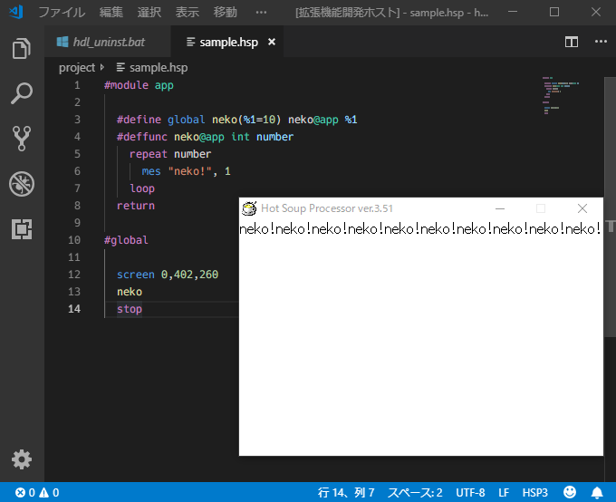

# language-hsp3 README

これは、atom版 [language-hsp3](https://github.com/honobonosun/language-hsp3) の移植です。  
This is porting extension of the "language-hsp3" for [atom](https://atom.io/).



注意、このバージョンはプレビューです！  
**ATTENTION**, This version is preview!

<kbd>F5</kbd> キーを押しても、HSPプログラムは実行されません。  
Push <kbd>F5</kbd> key is no running the HSP program.

代わりにターミナル タスクを使います。  
Use be substituted with terminal task.

## Setting terminal task for Windows OS
ターミナルタスクを設定する（Windows版）

既にatomで language-hsp3 をインストールしているなら、４番まで飛ばしてください。  
If you installed HSP3 and hspc.exe, please skip 3 steps.

以下の手順に従ってコンピューターを設定してください。  
Please setting your computer by following the steps below.

1. HSP3とhspc.exeをダウンロードしてください。  
   Please Download [HSP3](http://hsp.tv/) and [hspc.exe](http://dev.onionsoft.net/seed/info.ax?id=1392)
2. HSP3をインストール（または解凍してC:\ディレクトリに配置）してください。  
   Install HSP3 (or Extract, paste to path C:\\)
3. インストールしたHSP3にhspc.exeを挿入してください。  
   Insert hspc.exe file on the install HSP3 path.
4. インストールしたHSP3のパスを通してください。  
   Set PATH through HSP3 install directory path.
   - または、tasks.json の "command" を hspc.exe の絶対パスに書き換えます。  
   Or "tasks.json" in "command" char to you write "hspc.exe" file absolute path.
5. 作業用ディレクトリに ".vscode" ディレクトリを作ってください。  
   You create ".vscode" directory to working directory.
6. 下記のコードで ".\\.vscode\tasks.json" ファイルを作って書い（または張り付け）てください。  
   Use below json code, please you create and    (or paste) ".\\.vscode\tasks.json" file.

```json tasks.json
{
  "version": "2.0.0",
  "tasks": [
    {
      "label": "hsp: run",
      "type": "shell",
      "command": "hspc",
      "args": [
        "-dwrCa",
        {
          "value": "${file}",
          "quoting": "escape"
        }
      ],
      "group": {
        "kind": "test",
        "isDefault": true
      },
      "presentation": {
        "reveal": "always",
        "panel": "shared"
      }
    },
    {
      "label": "hsp: build",
      "type": "shell",
      "command": "hspc",
      "args": [
        "-PmCa",
        {
          "value": "${file}",
          "quoting": "escape"
        }
      ],
      "group": {
        "kind": "build",
        "isDefault": true
      },
      "presentation": {
        "reveal": "always",
        "panel": "shared"
      }
    }
  ]
}
```

<kbd>shift+p</kbd> で `task run` を入力して <kbd>enter</kbd> すれば、デバッグ実行が開始されます。  
Start HSP program command steps.
1. Push <kbd>shift+p</kbd> key
2. Char input `task run` and push <kbd>enter</kbd> key.
3. Can it one moer push <kbd>enter</kbd> key.

楽しもう！  
**Enjoy!**

あなたはタスクを設定しなおすことができます。もっとVSCodeのヒントを読む。  
You can task customize. more read hint in [VSCode document](https://code.visualstudio.com/docs/editor/tasks#_custom-tasks).

## todo ライセンス表記
runner,