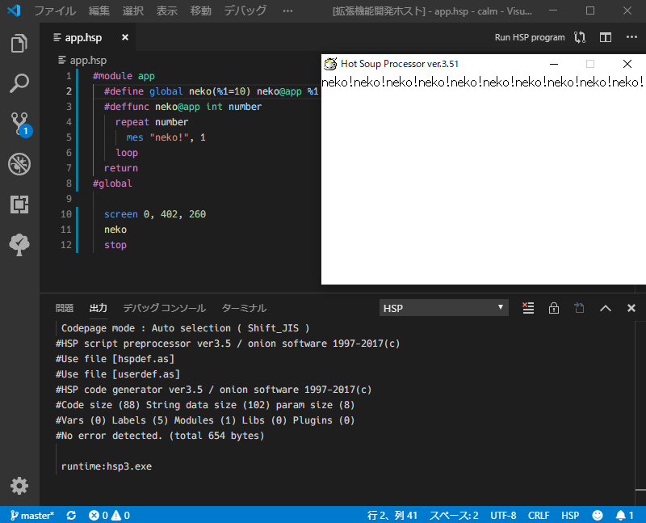

# language-hsp3 for VSCode

これは、atom版 language-hsp3 の移植です。  
This is porting extension of the "[language-hsp3](https://github.com/honobonosun/language-hsp3)" for [atom](https://atom.io/).



## Setup

既にHSP3とhspcをインストールしているなら、４番まで飛ばしてください。  
If you installed HSP3 and hspc, please skip 3 steps.

以下の手順に従ってコンピューターを設定してください。  
Please setting your computer by following the steps below.

日本語

1. HSPとhspcをダウンロードしてください。
2. コンピューターにHSPをインストールしてください。
3. hspcを解凍して、hspc.exeファイルをHSPがインストールされたディレクトリ（HSP3.51なら、デフォルトで _C:\\hsp351\\_）にコピーして貼り付けします。
4. **重要** HSPがインストールされたディレクトリにあるhsprtファイルをruntimeディレクトリにコピーしてください。
5. language-hsp3 拡張機能をインストールしてください。
6. VSCodeの設定画面の「拡張機能」の「HSP」の「compiler」にhspc.exeの絶対パスを設定します。
7. vscodeのエディタに `mes "Hello VSCode!"` を書いてhspファイルとして保存します。拡張子は".hsp"です。
8. エディタ上にある「Run HSP program」を押します。
9. 「Hello VSCode!」と表示されれば、セットアップは完了です。

English

1. Download [HSP](http://hsp.tv/) and [hspc](http://dev.onionsoft.net/seed/info.ax?id=1392).
2. Install the HSP on your computer.
3. Unzip hspc and copy and paste the hspc.exe file into the directory where the HSP was installed (For HSP 3.51, the default is _C:\\hsp351\\_ ).
4. _IMPORTANT_ Copy the hsprt file from the HSP installation directory to the runtime directory.
5. Install the language-hsp3 extension.
6. Set the absolute path of hspc.exe to "compiler" in "HSP" of "Settings" on the VSCode setting screen.
7. Write `mes "Hello VSCode!"` in the vscode editor and save it as an hsp file. The extension is ".hsp".
8. Press "Run HSP program" on the editor.
9. When "Hello VSCode!" is displayed, the setup is completed.

**Enjoy!**

### How do I use a console compiler other than hspc?

コマンドの実行時にコンパイラに渡される引数を設定できます。  
You can set the arguments that are passed to the compiler when you run the command.

settings.jsonファイルに以下のプロパティを設定できます。  
You can set the following properties in the settings.json file:

```json
// this command is "compiler arg1 arg2 filepath"
"language-hsp3.runCommands": [
  "arg1",
  "arg2",
  "%FILEPATH%"
],
"language-hsp3.makeCommands": [
  "arg1",
  "arg2",
  "%FILEPATH%"
]
```

`%FILEPATH%`は、特殊文字です。エディタのファイルパスに置き換わります。  
`%FILEPATH%` is a special character. Replaces the file path in the editor.

## Commands that will be available

| command | title | description |
|:--------|:------|:------------|
|language-hsp3.run | Run HSP program | アクティブなエディタで開いているファイルをHSPプログラムとして実行します。<br>Runs the file open in the active editor as an HSP program.|
|language-hsp3.make | Automatic exe file creation | アクティブなエディタで開いているファイルに対して自動実行ファイル作成を行います。<br>Automatic executable creation for files opened in the active editor.|

| command | default key |
|:--------|:------------|
|language-hsp3.run|Ctrl+K F5|
|language-hsp3.make|Ctrl+F9|

アクティブなエディタがない場合、コマンドは失敗します。  
If no editor is active, the command fails.

エディタの内容がファイルとして保存されていない場合、失敗します。  
If the contents of the editor are not saved as a file, it fails.

コマンドボタンは、HSP言語での編集中に表示されます。  
Command buttons appear while editing in the HSP language.

コマンドは、Altキーを押している間だけ切り替わります。  
The command switches only while you hold down the Alt key.

## Command execution with a new executor

v1.0.0からは、executorモジュールでコマンドが実行されます。  
Starting with v 1.0. 0, commands are executed in the executor module.

このモジュールは従来のコマンド実行と、hspc v2以降のhspc v2用引数付き実行コマンド、ステータスバーから使用するコンパイル設定の変更に対応します。  
This module supports legacy command execution, new argued execution commands since hspc v2, and changes to compilation setting from the status bar.

既定値では、従来と同じ動作に設定されています。  
By default, the behavior is set to the same as before.

**注意！この機能は廃止予定です。language-hsp3.executor.enableをfalseに設定して、従来の方法でご使用ください。任意のコマンドを実行するには、VSCodeのタスク機能をご使用ください。**

**Attention! This function is deprecated; please set language-hsp3.executor.enable to false and use the conventional method. To execute arbitrary commands, please use the task function of VSCode.**

~~新しいexecutorを有効化すると、従来の設定から新しい設定へ切り替わります。~~  
~~Enabling the new executor switches from the old setting to the new setting.~~

~~なので、複数のバージョンのHSPを使用しない場合、従来のコマンド実行から移行しなくても大丈夫です。~~  
~~So if you don't want to use multiple versions of HSP, you don't have to migrate from running traditional commands.~~

~~executorをカスタマイズする場合、json形式でキーと値を正しく設定する必要があります。~~  
~~If you customize executor, you must set keys and values correctly in json format.~~

### executor customize

```json
"language-hsp3.executor.paths": {
  // 実行ファイル単位で設定します。同じ実行ファイルでも、キーさえ違えば大丈夫です。
  "3.51": { // キーが切り替えの名前になります。
    "hide": false,  // trueにすると、このキーを切り替え候補に表示しません。
    "path": "C:\\hsp351\\hspc.exe", // 使用する実行ファイルの絶対パスを指定してください。
    "encoding": "Shift_JIS",  // 実行ファイルから返されるコードページを指定してください。
    "buffer": 204800, // 最大で受け取るbyte数を指定してください。
    "helpman": "C:\\hsp351\\helphsp\\helpman.exe",  // helpman.exeの絶対パスを指定してください。
    "commands": {
      "run": [  // デバッグ実行に相当するコマンド引数を指定してください。
        "-dwCra",
        "%FILEPATH%"
      ],
      "make": [ // 自動実行ファイル作成に相当するコマンド引数を指定してください。
        "-PmCa",
        "%FILEPATH%"
      ]
    }
  }
}
```

## License

### [language-hsp3 for VSCode](https://github.com/honobonosun/vscode-language-hsp3)
MIT License  
Copyright (c) 2019 Honobono

### [language-hsp3](https://github.com/honobonosun/language-hsp3)
MIT License  
Copyright (c) 2017-2018 Honobono

### [iconv-lite](https://www.npmjs.com/package/iconv-lite)
MIT License

Copyright (c) 2011 Alexander Shtuchkin
Permission is hereby granted, free of charge, to any person obtaining a copy of this software and associated documentation files (the "Software"), to deal in the Software without restriction, including without limitation the rights to use, copy, modify, merge, publish, distribute, sublicense, and/or sell copies of the Software, and to permit persons to whom the Software is furnished to do so, subject to the following conditions:

The above copyright notice and this permission notice shall be included in all copies or substantial portions of the Software.

THE SOFTWARE IS PROVIDED "AS IS", WITHOUT WARRANTY OF ANY KIND, EXPRESS OR IMPLIED, INCLUDING BUT NOT LIMITED TO THE WARRANTIES OF MERCHANTABILITY, FITNESS FOR A PARTICULAR PURPOSE AND NONINFRINGEMENT. IN NO EVENT SHALL THE AUTHORS OR COPYRIGHT HOLDERS BE LIABLE FOR ANY CLAIM, DAMAGES OR OTHER LIABILITY, WHETHER IN AN ACTION OF CONTRACT, TORT OR OTHERWISE, ARISING FROM, OUT OF OR IN CONNECTION WITH THE SOFTWARE OR THE USE OR OTHER DEALINGS IN THE SOFTWARE.

### [Code Runner](https://github.com/formulahendry/vscode-code-runner)
MIT License

Copyright (c) 2017 Jun Han

Permission is hereby granted, free of charge, to any person obtaining a copy
of this software and associated documentation files (the "Software"), to deal
in the Software without restriction, including without limitation the rights
to use, copy, modify, merge, publish, distribute, sublicense, and/or sell
copies of the Software, and to permit persons to whom the Software is
furnished to do so, subject to the following conditions:

The above copyright notice and this permission notice shall be included in all
copies or substantial portions of the Software.

THE SOFTWARE IS PROVIDED "AS IS", WITHOUT WARRANTY OF ANY KIND, EXPRESS OR
IMPLIED, INCLUDING BUT NOT LIMITED TO THE WARRANTIES OF MERCHANTABILITY,
FITNESS FOR A PARTICULAR PURPOSE AND NONINFRINGEMENT. IN NO EVENT SHALL THE
AUTHORS OR COPYRIGHT HOLDERS BE LIABLE FOR ANY CLAIM, DAMAGES OR OTHER
LIABILITY, WHETHER IN AN ACTION OF CONTRACT, TORT OR OTHERWISE, ARISING FROM,
OUT OF OR IN CONNECTION WITH THE SOFTWARE OR THE USE OR OTHER DEALINGS IN THE
SOFTWARE.

### [opener](https://github.com/domenic/opener)

Dual licensed under WTFPL and MIT:

---

Copyright © 2012–2018 Domenic Denicola <d@domenic.me>

This work is free. You can redistribute it and/or modify it under the
terms of the Do What The Fuck You Want To Public License, Version 2,
as published by Sam Hocevar. See below for more details.

        DO WHAT THE FUCK YOU WANT TO PUBLIC LICENSE
                    Version 2, December 2004

 Copyright (C) 2004 Sam Hocevar <sam@hocevar.net>

 Everyone is permitted to copy and distribute verbatim or modified
 copies of this license document, and changing it is allowed as long
 as the name is changed.

            DO WHAT THE FUCK YOU WANT TO PUBLIC LICENSE
   TERMS AND CONDITIONS FOR COPYING, DISTRIBUTION AND MODIFICATION

  0. You just DO WHAT THE FUCK YOU WANT TO.

---

The MIT License (MIT)

Copyright © 2012–2018 Domenic Denicola <d@domenic.me>

Permission is hereby granted, free of charge, to any person obtaining a copy
of this software and associated documentation files (the "Software"), to deal
in the Software without restriction, including without limitation the rights
to use, copy, modify, merge, publish, distribute, sublicense, and/or sell
copies of the Software, and to permit persons to whom the Software is
furnished to do so, subject to the following conditions:

The above copyright notice and this permission notice shall be included in all
copies or substantial portions of the Software.

THE SOFTWARE IS PROVIDED "AS IS", WITHOUT WARRANTY OF ANY KIND, EXPRESS OR
IMPLIED, INCLUDING BUT NOT LIMITED TO THE WARRANTIES OF MERCHANTABILITY,
FITNESS FOR A PARTICULAR PURPOSE AND NONINFRINGEMENT. IN NO EVENT SHALL THE
AUTHORS OR COPYRIGHT HOLDERS BE LIABLE FOR ANY CLAIM, DAMAGES OR OTHER
LIABILITY, WHETHER IN AN ACTION OF CONTRACT, TORT OR OTHERWISE, ARISING FROM,
OUT OF OR IN CONNECTION WITH THE SOFTWARE OR THE USE OR OTHER DEALINGS IN THE
SOFTWARE.

---

### [hsp3-vscode-syntax](https://github.com/vain0x/hsp3-ginger/blob/main/hsp3-vscode-syntax)

```txt
##################################################
# HSP3 GINGER Project
##################################################

Creative Commons Legal Code

CC0 1.0 Universal

    CREATIVE COMMONS CORPORATION IS NOT A LAW FIRM AND DOES NOT PROVIDE
    LEGAL SERVICES. DISTRIBUTION OF THIS DOCUMENT DOES NOT CREATE AN
    ATTORNEY-CLIENT RELATIONSHIP. CREATIVE COMMONS PROVIDES THIS
    INFORMATION ON AN "AS-IS" BASIS. CREATIVE COMMONS MAKES NO WARRANTIES
    REGARDING THE USE OF THIS DOCUMENT OR THE INFORMATION OR WORKS
    PROVIDED HEREUNDER, AND DISCLAIMS LIABILITY FOR DAMAGES RESULTING FROM
    THE USE OF THIS DOCUMENT OR THE INFORMATION OR WORKS PROVIDED
    HEREUNDER.

Statement of Purpose

The laws of most jurisdictions throughout the world automatically confer
exclusive Copyright and Related Rights (defined below) upon the creator
and subsequent owner(s) (each and all, an "owner") of an original work of
authorship and/or a database (each, a "Work").

Certain owners wish to permanently relinquish those rights to a Work for
the purpose of contributing to a commons of creative, cultural and
scientific works ("Commons") that the public can reliably and without fear
of later claims of infringement build upon, modify, incorporate in other
works, reuse and redistribute as freely as possible in any form whatsoever
and for any purposes, including without limitation commercial purposes.
These owners may contribute to the Commons to promote the ideal of a free
culture and the further production of creative, cultural and scientific
works, or to gain reputation or greater distribution for their Work in
part through the use and efforts of others.

For these and/or other purposes and motivations, and without any
expectation of additional consideration or compensation, the person
associating CC0 with a Work (the "Affirmer"), to the extent that he or she
is an owner of Copyright and Related Rights in the Work, voluntarily
elects to apply CC0 to the Work and publicly distribute the Work under its
terms, with knowledge of his or her Copyright and Related Rights in the
Work and the meaning and intended legal effect of CC0 on those rights.

1. Copyright and Related Rights. A Work made available under CC0 may be
protected by copyright and related or neighboring rights ("Copyright and
Related Rights"). Copyright and Related Rights include, but are not
limited to, the following:

  i. the right to reproduce, adapt, distribute, perform, display,
     communicate, and translate a Work;
 ii. moral rights retained by the original author(s) and/or performer(s);
iii. publicity and privacy rights pertaining to a person's image or
     likeness depicted in a Work;
 iv. rights protecting against unfair competition in regards to a Work,
     subject to the limitations in paragraph 4(a), below;
  v. rights protecting the extraction, dissemination, use and reuse of data
     in a Work;
 vi. database rights (such as those arising under Directive 96/9/EC of the
     European Parliament and of the Council of 11 March 1996 on the legal
     protection of databases, and under any national implementation
     thereof, including any amended or successor version of such
     directive); and
vii. other similar, equivalent or corresponding rights throughout the
     world based on applicable law or treaty, and any national
     implementations thereof.

2. Waiver. To the greatest extent permitted by, but not in contravention
of, applicable law, Affirmer hereby overtly, fully, permanently,
irrevocably and unconditionally waives, abandons, and surrenders all of
Affirmer's Copyright and Related Rights and associated claims and causes
of action, whether now known or unknown (including existing as well as
future claims and causes of action), in the Work (i) in all territories
worldwide, (ii) for the maximum duration provided by applicable law or
treaty (including future time extensions), (iii) in any current or future
medium and for any number of copies, and (iv) for any purpose whatsoever,
including without limitation commercial, advertising or promotional
purposes (the "Waiver"). Affirmer makes the Waiver for the benefit of each
member of the public at large and to the detriment of Affirmer's heirs and
successors, fully intending that such Waiver shall not be subject to
revocation, rescission, cancellation, termination, or any other legal or
equitable action to disrupt the quiet enjoyment of the Work by the public
as contemplated by Affirmer's express Statement of Purpose.

3. Public License Fallback. Should any part of the Waiver for any reason
be judged legally invalid or ineffective under applicable law, then the
Waiver shall be preserved to the maximum extent permitted taking into
account Affirmer's express Statement of Purpose. In addition, to the
extent the Waiver is so judged Affirmer hereby grants to each affected
person a royalty-free, non transferable, non sublicensable, non exclusive,
irrevocable and unconditional license to exercise Affirmer's Copyright and
Related Rights in the Work (i) in all territories worldwide, (ii) for the
maximum duration provided by applicable law or treaty (including future
time extensions), (iii) in any current or future medium and for any number
of copies, and (iv) for any purpose whatsoever, including without
limitation commercial, advertising or promotional purposes (the
"License"). The License shall be deemed effective as of the date CC0 was
applied by Affirmer to the Work. Should any part of the License for any
reason be judged legally invalid or ineffective under applicable law, such
partial invalidity or ineffectiveness shall not invalidate the remainder
of the License, and in such case Affirmer hereby affirms that he or she
will not (i) exercise any of his or her remaining Copyright and Related
Rights in the Work or (ii) assert any associated claims and causes of
action with respect to the Work, in either case contrary to Affirmer's
express Statement of Purpose.

4. Limitations and Disclaimers.

 a. No trademark or patent rights held by Affirmer are waived, abandoned,
    surrendered, licensed or otherwise affected by this document.
 b. Affirmer offers the Work as-is and makes no representations or
    warranties of any kind concerning the Work, express, implied,
    statutory or otherwise, including without limitation warranties of
    title, merchantability, fitness for a particular purpose, non
    infringement, or the absence of latent or other defects, accuracy, or
    the present or absence of errors, whether or not discoverable, all to
    the greatest extent permissible under applicable law.
 c. Affirmer disclaims responsibility for clearing rights of other persons
    that may apply to the Work or any use thereof, including without
    limitation any person's Copyright and Related Rights in the Work.
    Further, Affirmer disclaims responsibility for obtaining any necessary
    consents, permissions or other rights required for any use of the
    Work.
 d. Affirmer understands and acknowledges that Creative Commons is not a
    party to this document and has no duty or obligation with respect to
    this CC0 or use of the Work.
```